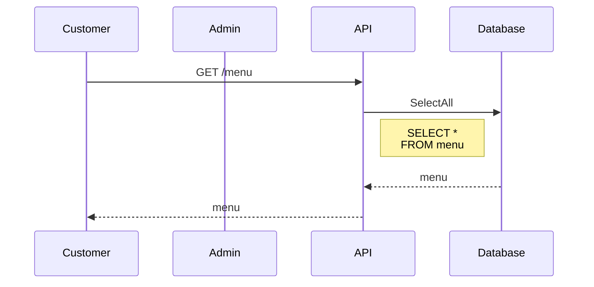
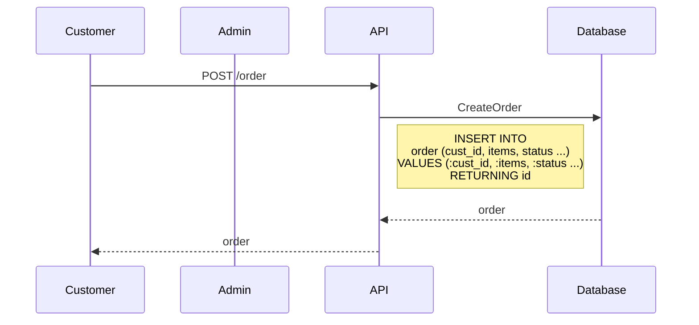
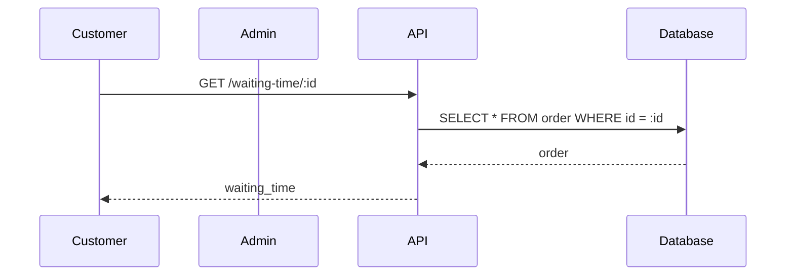
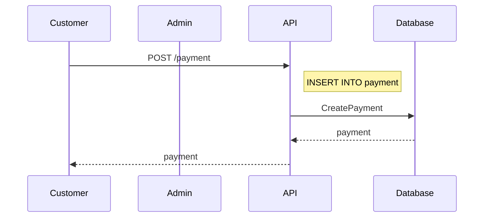
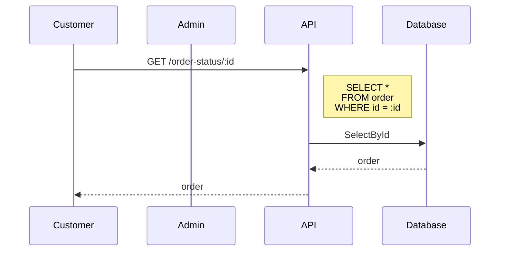
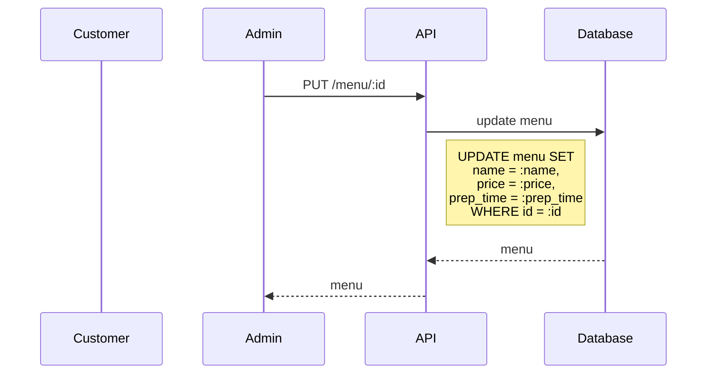
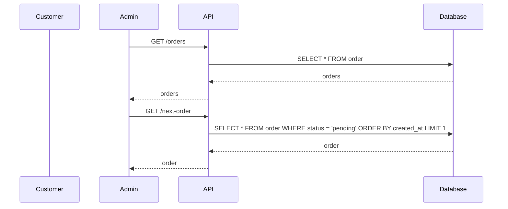
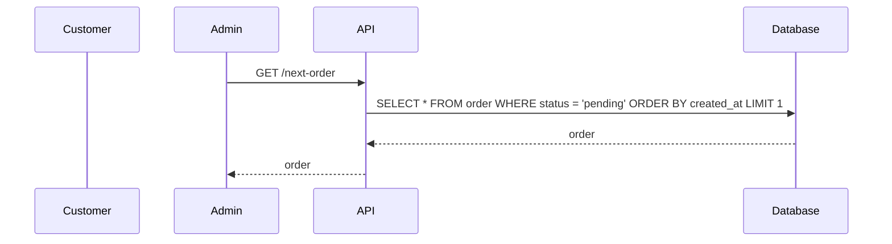
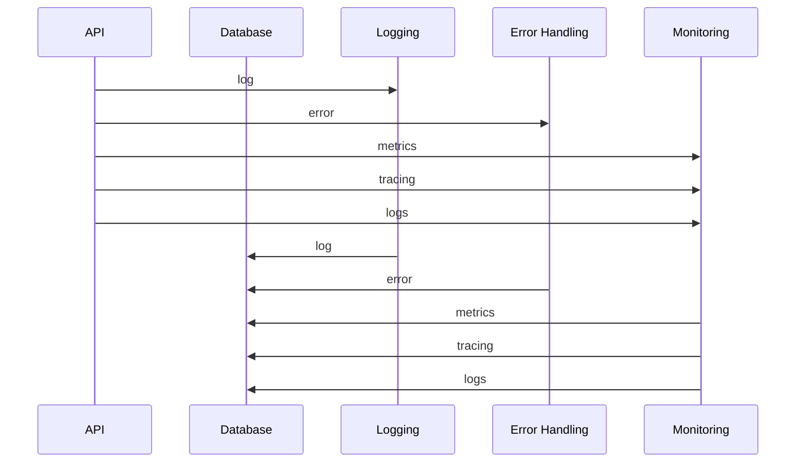

Let's create a go rest api application production ready with logs, error handling and monitoring using TDD. Let's say a takeaway shop wants a website for ordering food, and we want to keep track of the preparation time and the waiting queue to return a good estimate of the waiting time. The application will also allow to pay for the order. Naturally we will build this in small steps using tdd. Let's do the project analysis first.

# Project Analysis

## User Stories
1. As a customer I want to order food.
    1a. As a customer I want to browse the menu.
    1b. As a customer I want to submit my order.      

2. As a customer I want to know the waiting time.

3. As a customer I want to pay for the food (cash or credit card)

4. As a customer I want to know the status of my order.

5. As admin I want to edit the menu.

6.  As admin I want to know the status of the orders.
    6a. As admin I want to know the next order to prepare.

## Use Cases
1. Order food 
    1. Browse the menu          //GET /menu
    2. Submit the order         //POST /order

2. Get waiting time             //GET /waiting-time/:id

3. Pay for food                 //POST /payment

4. Get order status             //GET /order-status/:id

5. Edit the menu                //PUT /menu/:id

6. Get orders                   //GET /orders
    1. Get next order           //GET /next-order

## Project analysis charts

## Browse the menu

## Submit the order

## Get waiting time

## Make a payment

## Get status order 

## Update menu

## Get all orders

## Get next order

## API Logging, Error Handling and Monitoring

## Entities
1. Menu
    - id
    - name
    - price
    - preparation_time

2. Order
    - id
    - customer_id
    - items                     
    - status                    //pending, preparing, ready, delivered/collected
    - waiting_time
    - amount
    - payment_method            //cash, credit card

3. Payment
    - id
    - order_id
    - amount
    - payment_method            //cash, credit card
    - status                    //pending, paid

4. Login
    - id
    - name
    - email
    - password
    - role                      //customer, admin

5. Order Queue
    - id
    - order_id
    - status                    //pending, preparing, ready, delivered/collected
    - waiting_time
    - amount
    - payment_method            //cash, credit card

## API Endpoints
1. GET /menu
2. POST /order
3. GET /waiting-time/:id
4. POST /payment
5. GET /order-status/:id
6. PUT /menu/:id
7. GET /orders
8. GET /next-order  

## Architecture
1. Rest API
2. Database
3. Logging
4. Error Handling
5. Monitoring   

## Tech Stack ?
1. Go
2. Postgres
3. Docker
4. Kubernetes
5. Prometheus
6. Grafana
7. Jaeger
8. ELK Stack
